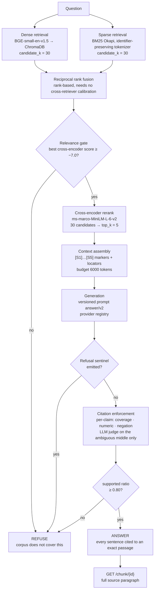
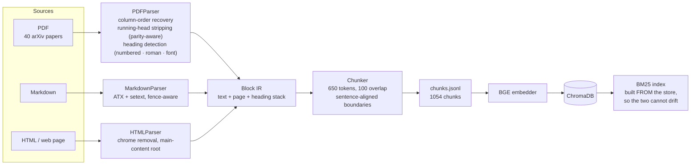
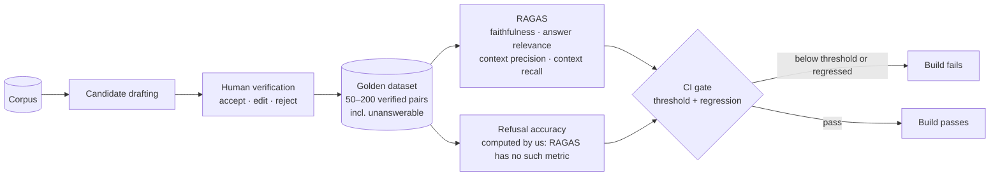

# Architecture

## Query path

## Ingestion path

## Evaluation path

## Why the structure is shaped this way

**Parsers emit blocks, not text.** Each block carries the page it came from and
the heading stack it sits under, so a citation can name a page and section.
Provenance is attached at parse time, where the information exists, rather than
reconstructed later from a flat string where it is already lost.

**Wide then narrow.** Each retriever proposes 30 candidates and the reranker
cuts to 5. A cross-encoder can only reorder what it is handed, so a passage
dense retrieval ranked twelfth can never reach first place from a five-item
shortlist.

**The sparse index is built from the vector store, not the chunk file.** Two
independently built indexes drift, and a BM25 hit for a chunk the store lacks
yields a citation whose click-through 404s.

**Grounding and relevance are separate gates.** A faithful quotation of an
irrelevant passage passes every citation check and still fails the user, so
relevance is decided by the cross-encoder before generation is even attempted.

**Every backend sits behind a protocol.** LLM, embeddings and reranker are
swappable, and deterministic offline implementations satisfy the same
contracts — which is why the full pipeline, citation enforcement included, runs
in CI with no API key and no run-to-run variance.
